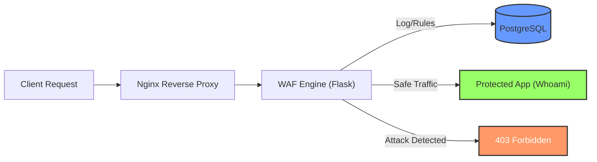

# ROAR-WAF (Rule-Oriented Architectural Request WAF)


**ROAR-WAF** is a lightweight, educational Web Application Firewall (WAF) designed to demonstrate core concepts of web traffic inspection and threat mitigation. It utilizes a stream-based inspection engine built with Python to detect and block malicious patterns in real-time without compromising system memory.

## 📖 Overview

This project serves as a practical implementation of a "Rule-Based" security model. It inspects HTTP headers, query parameters, and request bodies using configurable Regular Expressions (Regex) to mitigate common OWASP vulnerabilities.

## 🏗️ Architecture

The system follows a standard reverse-proxy architecture:



1. Nginx (Gateway): Handles incoming connections and buffers traffic.
2. WAF Engine (Flask): The core logic that streams and inspects traffic chunks using Head & Tail sampling.
3. PostgreSQL (Storage): Persists security rules, application routing configurations, and attack logs.
4. Upstream Service: The backend application being protected.

## 🛠️ Tech Stack

- Language: Python 3.14
- Web Framework: Flask
- WSGI Server: Gunicorn
- Database: PostgreSQL
- Infrastructure: Docker & Docker Compose

## 🛡️ Key Features

ROAR-WAF provides out-of-the-box protection against:

- 💉 SQL Injection (SQLi): Detects Union-based and Boolean-based injection attempts.
- ❌ Cross-Site Scripting (XSS): Blocks malicious script tags and JavaScript execution vectors.
- 📂 Local File Inclusion (LFI): Prevents unauthorized directory traversal (e.g., /etc/passwd).
- 💻 Command Injection (RCE): Filters system command execution characters (;, |, $).
- 🪵 Log4Shell: Mitigates legacy Log4j exploit attempts.
- 🚦 Smart Traffic Inspection: Efficiently scans URL parameters and request bodies using memory-safe stream processing.

## 🚀 Deployment Guide

### Prerequisites

Ensure you have Docker and Docker Compose installed on your machine.

- Installation

Clone the repository and navigate to the project directory:

```bash
git clone https://github.com/mowlandcodes/roar-waf.git
cd roar-waf
```

- Configuration

The project comes with a default configuration in `docker-compose.yaml`. Ensure the environment variables (especially `DATABASE_URL`) match your desired setup.

- Build and Run

Launch the Application Stack:

```bash
docker compose up --build -d
```

Wait until all containers (`roar_proxy`, `roar_engine`, `roar_db`) report a **healthy** or running status.

- Database Seeding

Initialize the database with default security rules and application routes:

```bash
docker exec -it roar_engine python seed.py
```

## 🧪 Testing & Validation

The WAF listens on port 8080 by default.

| Test Case      | Payload / URL                                        | Expected Result               |
| -------------- | ---------------------------------------------------- | ----------------------------- |
| Normal Traffic | <http://localhost:8080/>                             | 200 OK (Forwarded to Backend) |
| SQL Injection  | <http://localhost:8080/?q=>' OR 1=1--                | 403 Forbidden                 |
| XSS Attack     | <http://localhost:8080/?q=><script>alert(1)</script> | 403 Forbidden                 |
| LFI Attack     | <http://localhost:8080/?file=../../etc/passwd>       | 403 Forbidden                 |

## 📂 Project Structure

```text
.
├── Dockerfile              # WAF Engine Image Configuration
├── docker-compose.yaml     # Container Orchestration
├── main.py                 # Application Entry Point
├── seed.py                 # Database Seeder Script
├── requirements.txt        # Python Dependencies
├── libs/                   # Core Logic (Helpers, Logger)
├── models/                 # Database Models (Apps, Logs, Rules)
├── nginx/                  # Reverse Proxy Configuration
└── templates/              # Error Pages (403, 500)
```

## ⚠️ Disclaimer

**EDUCATIONAL USE ONLY**. This project is intended for research and educational purposes. It is NOT recommended for critical production environments without further hardening. The author is not responsible for any misuse or damages caused by this software.

---

<p align="center"> Built with ☕ by <a href="https://github.com/mowlandcodes">MowlandCodes</a> </p>
